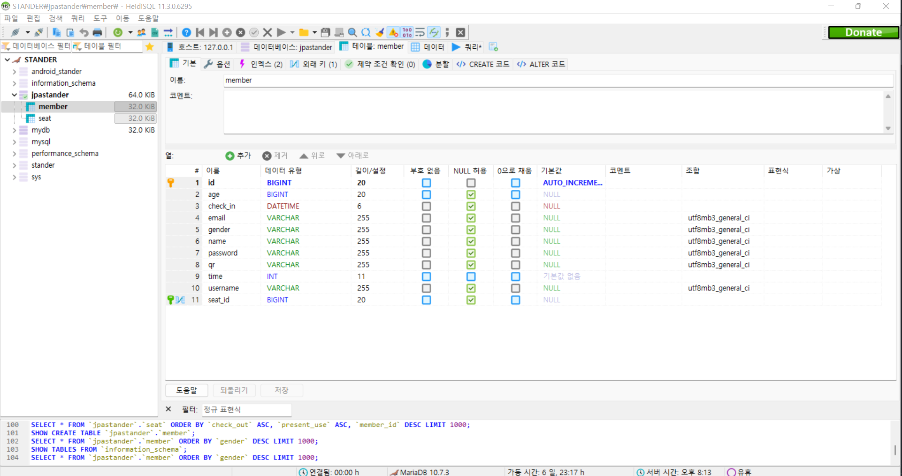
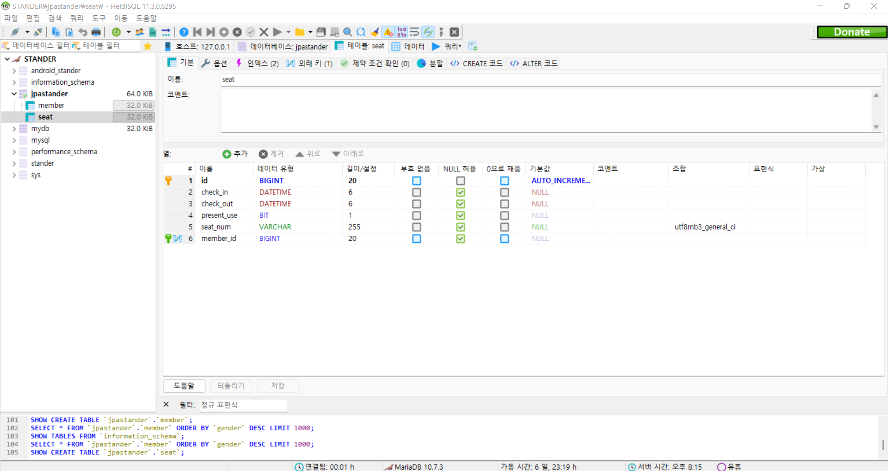

# STANDER

<h1>http://www.stander-mcs.com</h1>
<h1>http://3.38.33.154/</h1>

git clone https://github.com/zmfpdl64/STANDER.git

#기본 환경 설정

JDK 11버전 설정

<h3>환경변수 설정</h3>

JAVA_HOME -> JDK 위치 연결

Path 추가

%JAVA_HOME%\bin\

#사용한 웹 핵심 기술 스택

<h3>
1. Spring_Boot 
2. JPA 
3. MariaDB 

</h3>

#DB 설정

마리아 DB

resources/application.properties 설정

    spring.datasource.driverClassName=org.mariadb.jdbc.Driver
    spring.datasource.url=jdbc:mariadb://127.0.0.1:3307/stander //stander는 세션의 이름이다.
    spring.datasource.username=woojin //사용할 관리자의 아이디
    spring.datasource.password=1234  //사용할 관리자의 비밀번호 

HeidiSQL을 이용한 MariaDB 연결

https://jung-max.github.io/2020/06/24/Web-3_SpringBoot-MariaDb%EC%97%B0%EA%B2%B0/

설명이 잘 되어 있어 이걸 보고 진행해도 좋다.
<h3>Member Model</h3>

<h3>Seat Model</h3>

<h1>프로젝트명: STANDER </h1>

<h2> 무인카페 시스템</h2>
<h3>무인카페 시스템 프로젝트를 진행하게 된 계기:</h3>
<h3>대학생이라 스터디 카페를 많이 이용하는데 이용하면서 불편한 점들이 있었다.</h3>
<h3>1. 퇴실할 때 사용자가 퇴실하기 버튼을 누르지 않는다면 시간을 날려버리는 경우가 존재합니다.
퇴실처리를 위하여 다시 카페를 가는 번거로움이 있습니다. 그래서 사용자가 사용을 다하고 퇴실을 눌러 퇴실을 할 수 있게 설계하였습니다.</h3>
<h3>2. 많은 스터디 카페가 자사 앱, 웹을 가지고 있지 않아 예약하는데 있어 번거로움이 존재합니다. </h3>
<h3>3. 앱, 웹을 같은 db를 연동하여 앱, 웹을 통합한 시스템을 구현하고 싶었습니다.</h3>
   

<h2>무인 카페 시스템 원리</h2>

<h3>기능 블록도</h3>

<h3>크게 웹, 앱, IOT 파트로 나뉘어져 있다.</h3>
<h3>웹, 앱 파트 기능들</h3>
<h4>
1. 회원가입
2. 로그인
3. 예약하기
4. 결제하기
5. 마이페이지</h4>

<h3>IOT 파트 기능</h3>
<h4>
1. 카메라 모듈을 통한 QR코드 인식
2. Database에 접근하여 QR Column을 확인하여 서브 모터를 동작시킨다.(출입문)
</h4>

  

<h1> 무인 카페 시스템 메인 기능</h1>

<h3>1. 회원가입</h3>

<h3>회원가입 페이지로 로그인 규격에 맞지 않으면 빨간 글씨의 경고문이 웹페이지에 출력된다.<h3>
 
<h3>2. 로그인</h3>

<h3>로그인 기능도 회원가입과 동일한 형식으로 동작한다.</h3>
 
<h3>3. 예약하기</h3>

<h3>예약하기 기능으로 문의하기 시간이 존재한다면 로그인이 되며 시간이 없다면 시간결제 페이지로 이동한다.</h3>
 
<h3>4. 마이 페이지</h3>

<h3>예약 하기 전 마이 페이지</h3>
    
    

    
    
  

<h3>예약 한 후 마이 페이지</h3>
    
    

    
 
<h3>입실하기를 통해 생성시킨 QR코드를 이용하여 IOT 카메라 센서에 인식하게 되면 문이 열리게 된다.</h3>
 
<h3>6. 예외 처리</h3>

<h3>예약할 때 2가지의 예외처리를 진행했다.
1. 한사람이 두 좌석을 예약했을 때 예외처리 
2. 두사람이 동일한 좌석을 예약했을 때 예외처리 
    </h3>
 

