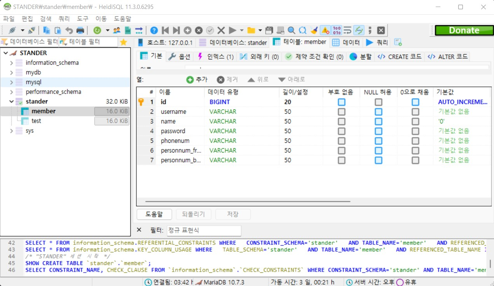

# STANDER

git clone https://github.com/zmfpdl64/STANDER.git

#기본 환경 설정

JDK 11버전 설정

<h3>환경변수 설정</h3>

JAVA_HOME -> JDK 위치 연결

Path 추가

%JAVA_HOME%\bin\

#DB 설정

마리아 DB

resources/application.properties 설정

    spring.datasource.driverClassName=org.mariadb.jdbc.Driver
    spring.datasource.url=jdbc:mariadb://127.0.0.1:3307/stander //stander는 세션의 이름이다.
    spring.datasource.username=woojin //사용할 관리자의 아이디
    spring.datasource.password=1234  //사용할 관리자의 비밀번호 

HeidiSQL을 이용한 MariaDB 연결

https://jung-max.github.io/2020/06/24/Web-3_SpringBoot-MariaDb%EC%97%B0%EA%B2%B0/

설명이 잘 되어 있어 이걸 보고 진행해도 좋다.

member의 database 형식으로 이것들을 똑같이 설정해주고 

id요소는 오른쪽 클릭을 통해 index추가하여 primary속성을 추가해준다.

